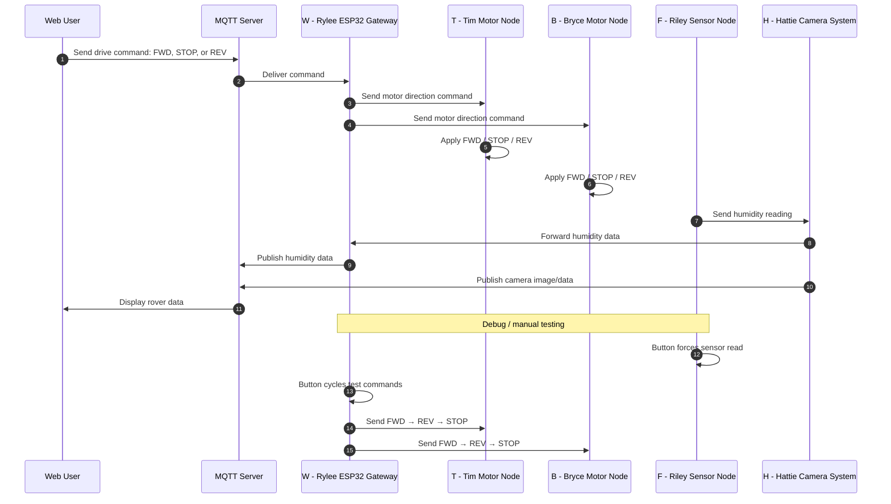

## Team Block Diagram
The following diagram illustrates the full team-level daisy-chain architecture including power distribution, ribbon cable connections, and microcontroller mappings.

## System Architecture Overview

The rover architecture is organized into modular functional nodes connected through the team communication system. Each node is responsible for a specific subsystem: gateway communication, drivetrain control, humidity sensing, and camera processing. This modular structure matches the team member responsibilities and allowed each subsystem to be developed and tested separately before integration.

The final system uses MQTT as the main communication link between the user interface and the rover. User drive commands are sent through MQTT to the gateway node, which then sends direction commands to the two motor nodes. Sensor and camera information are sent back toward MQTT so the user can view rover status and environmental information.

---

## Communication Architecture Rationale

The team structured the communication system around simple, readable commands instead of a more complex packet system. This decision made the system easier to debug and better matched the final functions that were actually implemented.

The most important user commands are:

- `FWD` — move the rover forward
- `REV` — move the rover in reverse
- `STOP` — stop the rover

These commands are received by the gateway and sent separately to both motor nodes. The humidity sensor and camera system use separate data paths so environmental data and camera output can be displayed to the user.

This structure was selected because it supports the main product requirements while keeping the communication system simple enough to integrate and troubleshoot during the semester.

---

## Power Architecture and Isolation

For the final demonstration, the rover uses wall power instead of a battery system. This choice made testing and demonstration more reliable because the team did not need to manage battery charge level, runtime limits, or voltage drop during repeated testing.

In a larger production version, a battery would be more appropriate because the rover would need to operate untethered. However, for the class demonstration, wall power provides a stable supply and reduces the chance of power-related failures while still allowing the team to demonstrate the communication, sensing, camera, and motor-control functions.

Power is still separated by subsystem as needed. Logic-level devices operate at regulated voltage levels appropriate for microcontrollers and sensors, while motor components use the power level required for drivetrain operation. Keeping these functions separated helps reduce electrical noise and improves reliability during motor startup, stopping, and direction changes.

---

## Requirements Alignment

The block diagram supports the project requirements by separating the rover into clear functional subsystems. The motor nodes support rover movement, the sensor node supports environmental sensing, the camera system supports user visibility, and the gateway connects the rover to MQTT.

The communication sequence supports the user needs by allowing the user to send simple movement commands and receive useful rover feedback. The user can command the rover to move forward, reverse, or stop, while also receiving humidity information and camera output through MQTT.

---

  
## Sequence Diagram

## Node IDs

| Node ID | Team Member / Subsystem | Function |
|---|---|---|
| `W` | Rylee ESP32 Gateway | Receives MQTT commands and sends motor commands |
| `T` | Tim Motor Node | Controls one motor |
| `B` | Bryce Motor Node | Controls one motor |
| `F` | Riley Sensor Node | Reads humidity sensor data |
| `H` | Hattie Camera System | Handles camera output and forwards humidity data |

---

## Message Structure

The final communication system uses simple command and data messages rather than the originally proposed complex message protocol. This helped reduce integration problems and made the system easier to test.

| Message / Data | Source | Destination | Purpose |
|---|---|---|---|
| `FWD` | MQTT / `W` | `T` and `B` | Command both motor nodes to move forward |
| `REV` | MQTT / `W` | `T` and `B` | Command both motor nodes to move in reverse |
| `STOP` | MQTT / `W` | `T` and `B` | Stop both motor nodes |
| Humidity reading | `F` | `H`, then `W` / MQTT | Send environmental humidity data to the user |
| Camera image/data | `H` | MQTT | Send camera output to the user interface |
| Debug sensor read | Button on `F` | `F` | Force an immediate humidity sensor reading |
| Debug motor cycle | Button on `W` | `T` and `B` | Send test sequence: `FWD`, then `REV`, then `STOP` |

## Communication Sequence Functionality and Requirements Alignment

The communication sequence was designed to directly support the user’s primary interaction with the rover. The user sends a movement command through MQTT, and the gateway node receives that command and distributes it to both motor nodes. This allows the rover to respond quickly to user input with simple and predictable behavior.

Separating the gateway from the motor nodes ensures that command handling and motor control are independent, which improves system reliability and makes debugging easier. If an issue occurs, it can be isolated to either communication or motor control rather than both.

The humidity sensing path supports environmental monitoring requirements. The sensor node sends humidity data through the camera system, which then forwards the data to the gateway. The gateway publishes this information to MQTT so the user can see real-time environmental data.

The camera system provides visual feedback by publishing image data directly to MQTT. This improves usability by giving the user immediate confirmation of the rover’s surroundings and actions.

Debug functionality also supports system validation. The sensor node button allows immediate testing of sensor readings, while the gateway button allows direct testing of motor commands without relying on the web interface. These features helped ensure that each subsystem worked correctly during integration.

---

## Message Structure Design Process

The original design used a structured packet-based protocol with defined message types, acknowledgements, error handling, and routing rules. While this approach was flexible, it introduced unnecessary complexity for the final system requirements.

During development, the team evaluated which features were actually needed. Since the rover primarily needed to move, report humidity, and stream camera data, the communication system was simplified to focus on those functions.

Using simple commands such as `FWD`, `REV`, and `STOP` reduced the amount of parsing required on each node and made it easier to test communication paths. It also reduced the likelihood of bugs related to incorrect packet formatting or unused message fields.

Separating command messages from sensor and camera data also improved clarity. Each subsystem handles only the messages relevant to its function, which simplifies both implementation and debugging.

---

## Top 5 Biggest Software Design Changes Since the Proposal

1. **Simplification of the communication protocol**  
   The original proposal included a detailed packet structure with message types, acknowledgements, error handling, telemetry requests, and configuration updates. During implementation, the team realized that many of these features were not necessary for the final system. The protocol was simplified to focus on essential commands (`FWD`, `REV`, `STOP`) and basic data transmission. This reduced complexity, improved reliability, and made debugging significantly easier.

2. **Adoption of MQTT as the primary communication interface**  
   The initial design considered more localized or custom communication methods. The final system uses MQTT as the primary interface between the user and the rover. This change improved flexibility by allowing commands and data to be transmitted over a standardized and widely supported protocol. It also made it easier to integrate the web interface and display real-time data.

3. **Separation of motor control into independent nodes**  
   Originally, motor control may have been more centralized or abstracted. In the final design, each motor is controlled by its own node. The gateway sends commands to both nodes independently, allowing each motor subsystem to operate and be tested separately. This improved modularity and made it easier to diagnose issues with individual motors.

4. **Modification of the sensor data path**  
   The original design likely assumed a more direct path between the sensor and the gateway. In the final implementation, the humidity sensor sends data through the camera system before reaching the gateway. This reflects the actual hardware layout and communication wiring. Updating the design to match this structure ensured consistency between documentation and implementation.

5. **Addition of debug button functionality**  
   Debugging features were added to improve testing and validation. The sensor node includes a button that forces a humidity reading, and the gateway includes a button that cycles through motor commands (`FWD`, `REV`, `STOP`). These additions allowed the team to test individual subsystems without relying on the full communication chain, which made integration faster and more reliable.

---

## Diagram Source Files

* Editable block diagram source file: Download Draw.io Source
* High resolution diagram image: Download PNG
* Full diagram asset bundle ZIP: Download Assets

All diagram source files are stored in the repository so the block diagram can be edited, reproduced, and reviewed.
