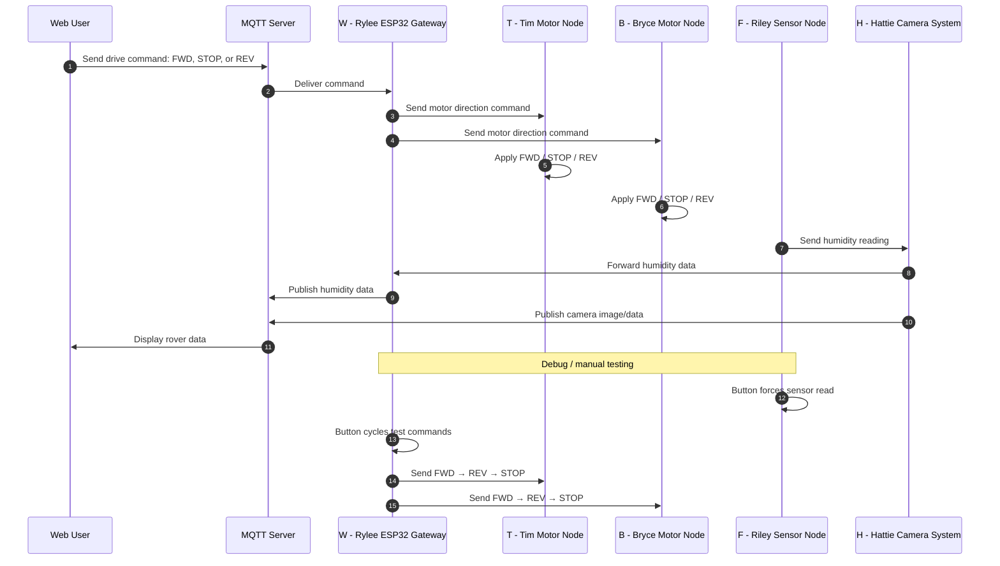

## Team Block Diagram
The following diagram illustrates the full team-level daisy-chain architecture including power distribution, ribbon cable connections, and microcontroller mappings.

## System Architecture Overview

The rover architecture is organized into modular functional nodes connected through the team communication system. Each node is responsible for a specific subsystem: gateway communication, drivetrain control, humidity sensing, and camera processing. This modular structure matches the team member responsibilities and allowed each subsystem to be developed and tested separately before integration.

The final system uses MQTT as the main communication link between the user interface and the rover. User drive commands are sent through MQTT to the gateway node, which then sends direction commands to the two motor nodes. Sensor and camera information are sent back toward MQTT so the user can view rover status and environmental information.

---

## Block Diagram Design Process

The block diagram was structured to reflect both the physical hardware layout and the communication flow between subsystems. The team chose a modular node-based design so that each subsystem could be developed independently while still integrating into the overall system.

A daisy-chain style communication structure was originally selected to reduce wiring complexity and simplify routing between boards. This approach also made it easier to trace message flow during debugging, since messages pass through nodes in a predictable order.

During development, the design was adjusted to better match the actual implemented system. The gateway node became the central connection point for MQTT communication, while motor, sensor, and camera subsystems were separated into individual nodes. This allowed clearer mapping between team responsibilities, hardware layout, and software functionality.

This final structure balances simplicity, modularity, and clarity, making it easier to both implement and explain.

---

## Communication Architecture Rationale

The team structured the communication system around simple, readable commands instead of a more complex packet system. This decision made the system easier to debug and better matched the final functions that were actually implemented.

The most important user commands are:

- `FWD` — move the rover forward  
- `REV` — move the rover in reverse  
- `STOP` — stop the rover  

These commands are received by the gateway and sent separately to both motor nodes. The humidity sensor and camera system use separate data paths so environmental data and camera output can be displayed to the user.

This structure was selected because it supports the main product requirements while keeping the communication system simple enough to integrate and troubleshoot during the semester.

---

## Power Architecture and Isolation

For the final demonstration, the rover uses wall power instead of a battery system. This choice made testing and demonstration more reliable because the team did not need to manage battery charge level, runtime limits, or voltage drop during repeated testing.

In a larger production version, a battery would be more appropriate because the rover would need to operate untethered. However, for the class demonstration, wall power provides a stable supply and reduces the chance of power-related failures while still allowing the team to demonstrate the communication, sensing, camera, and motor-control functions.

Power is still separated by subsystem as needed. Logic-level devices operate at regulated voltage levels appropriate for microcontrollers and sensors, while motor components use the power level required for drivetrain operation. Keeping these functions separated helps reduce electrical noise and improves reliability during motor startup, stopping, and direction changes.

---

## Requirements Alignment

The block diagram supports the project requirements by separating the rover into clear functional subsystems. The motor nodes support rover movement, the sensor node supports environmental sensing, the camera system supports user visibility, and the gateway connects the rover to MQTT.

The communication sequence supports the user needs by allowing the user to send simple movement commands and receive useful rover feedback. The user can command the rover to move forward, reverse, or stop, while also receiving humidity information and camera output through MQTT.

---

## Design Iteration and Feedback Integration

The block diagram and communication sequence diagram were updated throughout the project based on feedback from instructors and team reviews. Earlier versions of the design included a more complex communication protocol with additional message types, acknowledgements, and routing logic.

Based on feedback and implementation challenges, the team simplified the communication system to focus on core functionality. Unused or unnecessary features such as complex telemetry requests and extended packet structures were removed. The diagrams were updated to reflect the actual system behavior rather than the originally proposed design.

These changes improved clarity, reduced implementation complexity, and ensured that the final documentation accurately represents the working system.

---

## Sequence Diagram

  
## Sequence Diagram

## Node IDs

| Node ID | Team Member / Subsystem | Function |
|---|---|---|
| `W` | Rylee ESP32 Gateway | Receives MQTT commands and sends motor commands |
| `T` | Tim Motor Node | Controls one motor |
| `B` | Bryce Motor Node | Controls one motor |
| `F` | Riley Sensor Node | Reads humidity sensor data |
| `H` | Hattie Camera System | Handles camera output and forwards humidity data |

---

## Message Structure

The final communication system uses simple command and data messages rather than the originally proposed complex message protocol. This helped reduce integration problems and made the system easier to test.

| Message / Data | Source | Destination | Purpose |
|---|---|---|---|
| `FWD` | MQTT / `W` | `T` and `B` | Command both motor nodes to move forward |
| `REV` | MQTT / `W` | `T` and `B` | Command both motor nodes to move in reverse |
| `STOP` | MQTT / `W` | `T` and `B` | Stop both motor nodes |
| Humidity reading | `F` | `W` / MQTT | Send environmental humidity data to the user |
| Camera image/data | `H` | MQTT | Send camera output to the user interface |
| Debug sensor read | Button on `F` | `F` | Force an immediate humidity sensor reading |
| Debug motor cycle | Button on `W` | `T` and `B` | Send test sequence: `FWD`, then `REV`, then `STOP` |

---

## Communication Sequence Functionality and Requirements Alignment

As shown in the sequence diagram above, the communication system is designed to minimize latency between user input and rover response. Commands are sent from the user through MQTT to the gateway, which immediately distributes them to the motor nodes. This ensures fast and predictable control of the rover.

Separating command flow from sensor and camera data prevents interference between control and feedback systems. This allows high-bandwidth camera data to be transmitted without delaying critical motor commands.

The humidity sensing path supports environmental monitoring requirements. The sensor node sends humidity data through the camera system, which forwards it to the gateway and then to MQTT for user display.

The camera system provides visual feedback by publishing image data directly to MQTT, allowing the user to observe rover surroundings in real time.

Debug functionality supports system validation. The sensor node button allows immediate testing of sensor readings, while the gateway button allows direct testing of motor commands without requiring the full communication chain.

---

## Message Structure Design Process

The original design used a structured packet-based protocol with defined message types, acknowledgements, error handling, and routing rules. While flexible, this approach introduced unnecessary complexity for the final system.

The team evaluated system requirements and determined that only a small set of commands and data types were needed. Simplifying the communication structure reduced parsing complexity, improved reliability, and made debugging easier.

This decision prioritized ease of implementation and alignment with actual system functionality over extensibility that was not required for the final design.

---

## Top 5 Biggest Software Design Changes Since the Proposal

1. **Simplification of the communication protocol**  
   As shown in the sequence diagram, the original packet-based system with ACKs, telemetry, and error handling was replaced with a simpler command-based approach. This reduced complexity and improved reliability.

2. **Adoption of MQTT as the primary communication interface**  
   The system now uses MQTT for all user interaction. This change improved flexibility and made it easier to integrate a web-based interface for control and monitoring.

3. **Separation of motor control into independent nodes**  
   The updated diagram shows that each motor is controlled by its own node. This improved modularity and allowed each motor system to be tested independently.

4. **Modification of the sensor data path**  
   The sequence diagram reflects that humidity data is routed through the camera system before reaching the gateway. This matches the final hardware configuration.

5. **Addition of debug button functionality**  
   The diagram shows local button-triggered behavior. These features allowed testing of sensor readings and motor commands without relying on MQTT, improving development efficiency.

---

## Diagram Source Files

* Editable block diagram source template: [Download Draw.io Template](https://embedded-systems-design.bitbucket.io/314/team-assignments/block-diagram-protocol-and-message-structure/314-spring-2025-block%20diagram-data.drawio)  
* High resolution diagram image: [Download PNG]()

