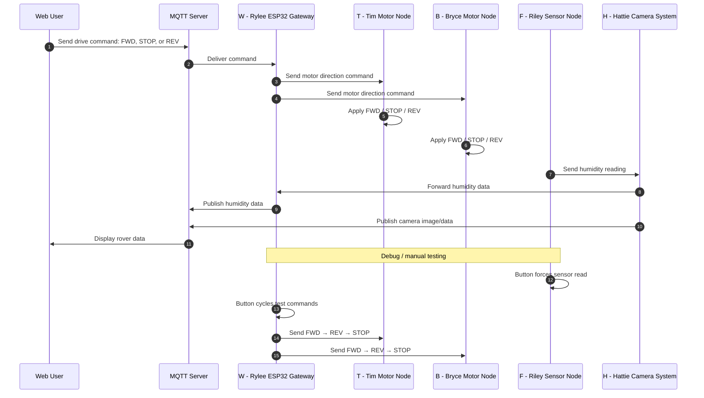

## Team Block Diagram
The following diagram illustrates the full team-level daisy-chain architecture including power distribution, ribbon cable connections, and microcontroller mappings.

## System Architecture Overview

The rover architecture is organized into modular functional nodes connected in a daisy-chain communication structure. Each node is responsible for a clearly defined subsystem, including controller input, drivetrain control, environmental sensing, camera processing, and gateway communication. This modular grouping aligns with team member ownership and allows hardware and firmware development to occur in parallel while maintaining clean integration boundaries.

The daisy-chain structure was selected to simplify physical wiring and reduce routing complexity between distributed boards. Rather than implementing a fully connected bus, each node forwards messages downstream unless the destination address matches its own node ID. This reduces the number of required communication lines while preserving deterministic routing behavior.

---

## Communication Architecture Rationale

The team selected a structured packet-based communication protocol with explicit source and destination addressing to ensure reliable message routing and traceability. Each message includes a source ID, destination ID, message type, and payload, allowing commands, telemetry, acknowledgements, and error reporting to coexist within a single unified format.

A daisy-chain forwarding model was chosen over broadcast-only or peer-to-peer architectures to:

- Minimize wiring complexity
- Simplify debugging by preserving packet order
- Enable deterministic routing and TTL handling
- Maintain compatibility with class framing requirements

The use of ACK and error packets improves reliability and supports traceable debugging during integration and demonstration.

---

## Power Architecture and Isolation

Power is distributed from the central battery system and regulated locally at each subsystem as required. Logic-level devices operate at regulated voltage levels appropriate for microcontrollers and sensors, while drivetrain components draw higher current from the primary supply rail.

Separating logic regulation from motor power reduces electrical noise coupling and minimizes the risk of brownout events when motors experience load spikes. This power segmentation improves overall system reliability and aligns with project requirements for stable communication, sensor accuracy, and safe operation.

---

## Requirements Alignment

The block diagram directly supports the measurable system requirements defined in the Project Requirements section. Modular node separation enables independent verification of drivetrain mobility, environmental sensing accuracy, wireless communication range, and controller responsiveness.

The structured communication protocol ensures:

- Reliable wireless command transmission
- Deterministic telemetry reporting
- Rapid emergency stop propagation
- Clear error reporting and debugging support

The power segmentation strategy supports runtime duration requirements and protects subsystem stability during load variation. Overall, the architecture was intentionally structured to satisfy reliability, safety, and expandability requirements while remaining achievable within the semester timeline.

  
## Sequence Diagram

## Message Types

All packets follow the required 64 byte framing format:

| Byte | Description |
|---|---|
| 0 | `0x41` |
| 1 | `0x5A` |
| 2 | Source ID (`uint8_t`) |
| 3 | Destination ID (`uint8_t`) |
| 4 to 61 | Message, variable length <= 58 bytes |
| 62 | `0x59` |
| 63 | `0x42` |

Within bytes 4 to 61:

* Bytes 4 to 5 = Message Type (`uint16_t`, big endian)
* Remaining bytes = Message specific payload

All multi byte values use big endian format.  
All strings must be null terminated (`0x00`).

## Node IDs

| Node | ID |
|---|---|
| Riley Gateway | `F` |
| Hattie Camera / Sensors | `H` |
| Rylee Controller Input | `W` |
| Bryce Motor Node | `B` |
| Tim Motor Node | `T` |
| Broadcast | `X` |

## Addressing Scheme

Each node in the system is assigned a unique 8 bit identifier. The Source ID field identifies the originating node, while the Destination ID field identifies the intended recipient.

If the Destination ID matches the local node ID, the packet is consumed and processed. If the Destination ID is `X`, the packet is treated as a broadcast message and forwarded by all nodes. Otherwise, the packet is forwarded downstream according to routing rules.

This addressing scheme ensures deterministic routing behavior and supports both targeted commands and broadcast telemetry requests.

## Message Types

### `0x0001` — Set Motor Speed

**Description:** Command a motor controller to set speed and direction.

| Byte | Field |
|---|---|
| 4 | `0x00` |
| 5 | `0x01` |
| 6 | Motor ID (`uint8_t`) |
| 7 | Speed High (`uint8_t`) |
| 8 | Speed Low (`uint8_t`) |
| 9 | Direction (`0 = FWD`, `1 = REV`) |
| 10 | Control Flags (`uint8_t`) |
| 11 to 61 | Reserved |

### `0x0002` — Request Telemetry

**Description:** Request telemetry from a specific node or broadcast to all nodes.

| Byte | Field |
|---|---|
| 4 | `0x00` |
| 5 | `0x02` |
| 6 | Telemetry Mask (`uint8_t`) |
| 7 | Timeout in seconds (`uint8_t`) |
| 8 to 61 | Reserved |

Telemetry Mask Bits:

* bit0 = Distance
* bit1 = Motion
* bit2 = Temperature
* bit3 = Hall sensor
* bit4 = Motor RPM

### `0x0003` — Telemetry Packet

**Description:** Sensor and system status data.

| Byte | Field |
|---|---|
| 4 | `0x00` |
| 5 | `0x03` |
| 6 to 7 | Distance (`uint16_t`, mm) |
| 8 | Motion (`uint8_t`, 0 or 1) |
| 9 to 10 | Temperature (`int16_t`, tenths °C) |
| 11 to 12 | Motor RPM (`uint16_t`) |
| 13 | Status Flags (`uint8_t`) |
| 14 to 61 | Reserved |

Status Flags:

* bit0 = Motor running
* bit1 = Error present
* bit2 = Low battery

### `0x0004` — ACK

**Description:** Acknowledge receipt and execution of a command.

| Byte | Field |
|---|---|
| 4 | `0x00` |
| 5 | `0x04` |
| 6 | Acked Message Type high byte |
| 7 | Acked Message Type low byte |
| 8 | Status (`0 = OK`, `1 = ERROR`) |
| 9 | Error Code |
| 10 to 61 | Optional null terminated text |

### `0x0005` — Error / Event Log

**Description:** Error reporting and diagnostic message.

| Byte | Field |
|---|---|
| 4 | `0x00` |
| 5 | `0x05` |
| 6 | Error Code |
| 7 | Severity (`0 = info`, `1 = warn`, `2 = error`, `3 = fatal`) |
| 8 to 61 | Null terminated ASCII string |

### `0x0043` — Button Press

**Description:** Local HMI button event.

| Byte | Field |
|---|---|
| 4 | `0x00` |
| 5 | `0x43` |
| 6 | Button ID (`uint8_t`) |
| 7 | Press Type (`0 = short`, `1 = long`, `2 = double`) |
| 8 | Debounce / Sequence (`uint8_t`) |
| 9 to 61 | Optional null terminated text |

### `0x0FFF` — Config Update

**Description:** Configuration update message.

| Byte | Field |
|---|---|
| 4 | `0x0F` |
| 5 | `0xFF` |
| 6 | Config ID (`uint8_t`) |
| 7 | Data Length (`uint8_t`) |
| 8 to (8 + N - 1) | Config Data |
| Remaining | Reserved |

## Error Codes

| Code | Meaning |
|---|---|
| `0x01` | Motor not found |
| `0x02` | Invalid parameter |
| `0x03` | Overcurrent |
| `0x04` | TTL expired |
| `0x05` | Destination unreachable |
| `0x06` | CRC failure |
| `0x07` | Unsupported message type |
| `0x08` | Resource busy |

## Routing Rules

1. If Destination ID equals local node ID, consume packet.
2. If Destination ID equals `X`, broadcast and optionally respond.
3. Otherwise, forward to downstream neighbor.
4. ACK messages must be routed back to the Source ID.
5. Preserve bytes 0 to 3 and 62 to 63 unchanged when forwarding.

## Diagram Source Files

* Editable block diagram source file: Download Draw.io Source
* High resolution diagram image: Download PNG
* Full diagram asset bundle ZIP: Download Assets

All diagram source files are stored in the Appendix to ensure reproducibility and transparency of system design.

This document defines the canonical team message protocol and must be implemented consistently across all boards.
