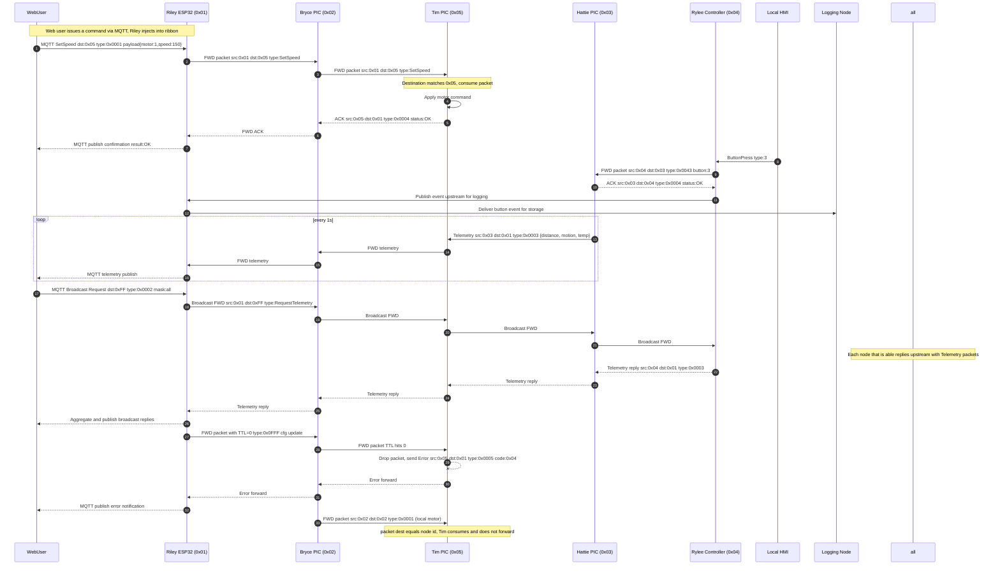

## Team Block Diagram

  
## Sequence Diagram

```mermaid
sequenceDiagram
    autonumber
    participant WebUser
    participant Riley as Riley ESP32 (0x01)
    participant Bryce as Bryce PIC (0x02)
    participant Tim as Tim PIC (0x05)
    participant Hattie as Hattie PIC (0x03)
    participant Rylee as Rylee Controller (0x04)
    participant HMI as Local HMI
    participant Logger as Logging Node

    Note over WebUser,Riley: Web user issues a command via MQTT, Riley injects into ribbon

    %% 1) Web driven, targeted SetSpeed to Tim
    WebUser->>Riley: MQTT SetSpeed dst:0x05 type:0x0001 payload{motor:1,speed:150}
    Riley->>Bryce: FWD packet src:0x01 dst:0x05 type:SetSpeed
    Bryce->>Tim: FWD packet src:0x01 dst:0x05 type:SetSpeed
    Note over Tim: Destination matches 0x05, consume packet
    Tim->>Tim: Apply motor command
    Tim-->>Bryce: ACK src:0x05 dst:0x01 type:0x0004 status:OK
    Bryce-->>Riley: FWD ACK
    Riley-->>WebUser: MQTT publish confirmation result:OK

    %% 2) In person HMI event at Rylee forwarded upstream for logging and action
    HMI->>Rylee: ButtonPress type:3
    Rylee->>Hattie: FWD packet src:0x04 dst:0x03 type:0x0043 button:3
    Hattie-->>Rylee: ACK src:0x03 dst:0x04 type:0x0004 status:OK
    Rylee->>Riley: Publish event upstream for logging
    Riley->>Logger: Deliver button event for storage

    %% 3) Periodic telemetry, recurring sequence every 1s
    loop every 1s
        Hattie->>Tim: Telemetry src:0x03 dst:0x01 type:0x0003 {distance, motion, temp}
        Tim->>Bryce: FWD telemetry
        Bryce->>Riley: FWD telemetry
        Riley-->>WebUser: MQTT telemetry publish
    end

    %% 4) Broadcast request for status from WebUser
    WebUser->>Riley: MQTT Broadcast Request dst:0xFF type:0x0002 mask:all
    Riley->>Bryce: Broadcast FWD src:0x01 dst:0xFF type:RequestTelemetry
    Bryce->>Tim: Broadcast FWD
    Tim->>Hattie: Broadcast FWD
    Hattie->>Rylee: Broadcast FWD
    Note over all: Each node that is able replies upstream with Telemetry packets
    Rylee-->>Hattie: Telemetry reply src:0x04 dst:0x01 type:0x0003
    Hattie-->>Tim: Telemetry reply
    Tim-->>Bryce: Telemetry reply
    Bryce-->>Riley: Telemetry reply
    Riley-->>WebUser: Aggregate and publish broadcast replies

    %% 5) Example of a message tossed because of TTL expiry or malformed header
    Riley->>Bryce: FWD packet with TTL=0 type:0x0FFF cfg update
    Bryce->>Tim: FWD packet TTL hits 0
    Tim--xTim: Drop packet, send Error src:0x05 dst:0x01 type:0x0005 code:0x04
    Tim-->>Bryce: Error forward
    Bryce-->>Riley: Error forward
    Riley-->>WebUser: MQTT publish error notification

    %% 6) Disposal example where an intermediate node discards a message targeted at a different local submodule
    Bryce->>Tim: FWD packet src:0x02 dst:0x02 type:0x0001 (local motor)
    Note over Tim: packet dest equals node id, Tim consumes and does not forward
```
  

## Message Types

